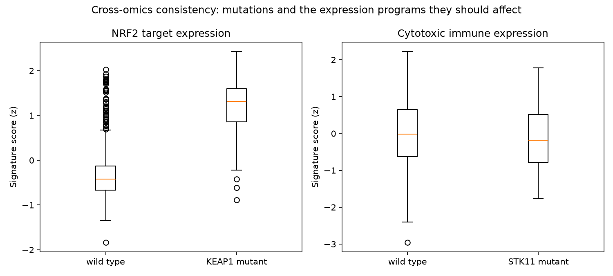
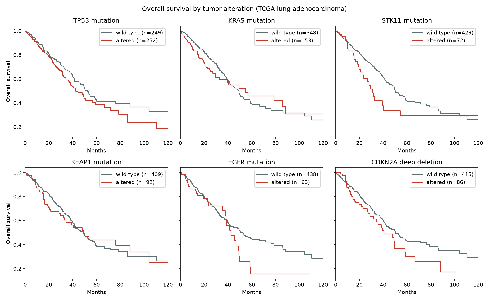

# Multi-Omics Survival Analysis in Lung Adenocarcinoma (TCGA)

What do tumor mutations, copy-number changes, and gene expression add to clinical factors for predicting survival
in lung adenocarcinoma? An end-to-end analysis of 566 patients from the TCGA PanCancer Atlas, downloaded
reproducibly from the public cBioPortal API.

> **Findings:** (1) The data reproduce known biology: driver mutation frequencies match published TCGA results, and
> KEAP1-mutant tumors show strongly higher NRF2 pathway expression. (2) STK11 mutation and tumor proliferation are
> independently associated with worse survival, robust to adjustment for stage and to a stage-stratified model.
> (3) Yet molecular data add little to *overall* survival prediction beyond stage: the cross-validated C-index rose
> only from 0.660 to 0.673, within fold-to-fold variability.

## Data

TCGA Lung Adenocarcinoma, PanCancer Atlas, accessed through the cBioPortal REST API (`python -m luad.fetch`):
clinical data, somatic mutations in 14 lung cancer genes, copy-number changes, and RNA-seq expression for 31 genes
in four signatures. Data are downloaded, not committed.

| Layer | Content |
|---|---|
| Clinical | Age, sex, stage, genetic ancestry, overall and progression-free survival |
| Mutations | Protein-altering mutations in TP53, KRAS, EGFR, STK11, KEAP1, and 9 other genes; KRAS G12C and classic EGFR activating mutations flagged |
| Copy number | MET and ERBB2 amplification, CDKN2A deep deletion |
| Expression | Proliferation, cytotoxic immune, NRF2 target, and immune checkpoint signatures |

**Cohort:** 566 patients; median age 66; 48.6% female; stage I 49.1%, II 21.9%, III 14.7%, IV 4.8%, unknown 9.5%;
186 deaths over a median follow-up of 21.5 months.

## Validation against known biology

Before modeling, results were checked against established findings:

| Check | Result |
|---|---|
| Mutation frequencies vs. published TCGA lung adenocarcinoma | TP53 50.7%, KRAS 29.7%, KEAP1 18.0%, STK11 13.1%, EGFR 12.2%: consistent with published rates |
| KRAS G12C as a share of KRAS mutations | About 40%, as expected |
| KEAP1 mutation → NRF2 target expression (KEAP1 normally degrades NRF2) | **1.73 SD higher** in KEAP1-mutant tumors (p = 3e-36) |
| STK11 mutation → immune checkpoint expression (STK11-mutant tumors are reported to be immunologically "cold") | 0.29 SD lower (p = 0.011); cytotoxic immune score lower but not significant (p = 0.24) |



## Survival results

**Kaplan-Meier** (501 patients with usable survival data, 181 deaths): STK11 mutation was associated with shorter
median overall survival (31.2 vs 50.2 months, log-rank p = 0.026), as were KRAS G12C and SMARCA4 mutations
(p < 0.05). None remained significant after false discovery rate correction across the 8 alterations tested
(all q = 0.13), and the KRAS co-mutation question (STK11 or KEAP1 co-mutation within KRAS-mutant tumors) pointed in
the published direction without reaching significance (p = 0.12).



**Cox models:**

| Factor | Hazard ratio (95% CI) | p |
|---|---|---|
| Stage II vs I | 1.9 to 2.0 | < 0.001 |
| Stage III vs I | 2.9 to 3.1 | < 0.001 |
| Stage IV vs I | 3.1 to 3.4 | < 0.001 |
| **STK11 mutation** | **1.80 (1.19-2.73)** | 0.006 |
| **Proliferation signature (per SD)** | **1.45 (1.19-1.76)** | < 0.001 |
| NRF2 target signature (per SD) | 1.01 (0.81-1.27) | 0.90 |
| Cytotoxic immune signature (per SD) | 0.98 (0.72-1.32) | 0.87 |

Both molecular findings held in a model stratified by stage (STK11 HR 1.75, p = 0.008; proliferation HR 1.43,
p < 0.001), which removes the proportional-hazards assumption for stage. Stage hazard ratios come from the
clinical-only and clinical + mutation models (489 patients, 178 deaths); molecular rows come from the full
multi-omics model (485 patients with complete clinical, mutation, and expression data, 177 deaths).

**Does each molecular layer improve prediction?** All models fitted on the same 485 patients:

| Model | Covariates | Cross-validated C-index (5 x 5-fold) | Apparent C-index |
|---|---|---|---|
| Clinical (age, sex, stage) | 5 | 0.660 | 0.669 |
| + mutations and TMB | 12 | 0.670 | 0.697 |
| + expression signatures | 16 | 0.673 | 0.707 |

The cross-validated gains (+0.010, then +0.003) are smaller than the fold-to-fold standard deviation (about 0.04),
while the apparent C-index rose almost four times as much. Two specific molecular factors carry real prognostic
information, but because stage dominates and those factors affect subsets of patients, they barely change how well
the model ranks patients overall.

## Responsible use and representation

- **Genetic ancestry:** 86.7% of patients have European genetic ancestry and only 1.6% East Asian. Classic EGFR
  activating mutations are far more common in East Asian patients with lung adenocarcinoma, so findings involving
  EGFR-driven tumors may not generalize to the populations where those tumors are most common.
- **Missing data are reported, not hidden:** 65 patients lacked usable survival data; 2 patients with unknown stage
  in the modeling cohort were excluded from Cox models rather than merged into a reference category.
- **Associations, not causes:** hazard ratios describe prognosis in this cohort, not treatment effects.

## Limitations

- No treatment data and no smoking history in this dataset, both important confounders in lung cancer outcomes.
- Short median follow-up (21.5 months) and moderate size limit statistical power.
- Proportional hazards were questionable for sex, KRAS, and stage III; the stage-stratified model addresses stage
  only.
- Expression genes were standardized across the whole cohort before cross-validation; this unsupervised step uses no
  outcome information, but strictly it should be fitted within training folds.
- Signatures are compact, hypothesis-driven gene sets rather than a genome-wide analysis.

## How to run

```bash
pip install -r requirements.txt
pip install -e .
pytest                         # 9 tests, including recovery of a planted hazard ratio
python -m luad.fetch           # download from cBioPortal into data/raw/
python -m luad.features        # one row per patient; Table 1, frequencies, ancestry, data quality
python -m luad.survival        # Kaplan-Meier, co-mutation, Cox models, cross-validated C-index
python -m luad.multiomics      # expression signatures, consistency checks, multi-omics comparison
```

## Project structure

```
src/luad/fetch.py         reproducible download from the cBioPortal REST API
src/luad/features.py      patient-level clinical, mutation, copy-number features; validation summaries
src/luad/survival.py      Kaplan-Meier, log-rank with FDR, Cox models, cross-validated C-index, PH check
src/luad/multiomics.py    expression signatures, cross-omics checks, three-layer model comparison
```

## Data source

The results here are based on data generated by the TCGA Research Network (https://www.cancer.gov/tcga), accessed
through cBioPortal for Cancer Genomics (https://www.cbioportal.org).

## Author

**Oshin Miranda, PhD** | [LinkedIn](https://www.linkedin.com/in/oshin-miranda-ph-d-9551781b5/) | [GitHub](https://github.com/oshinmiranda26)
